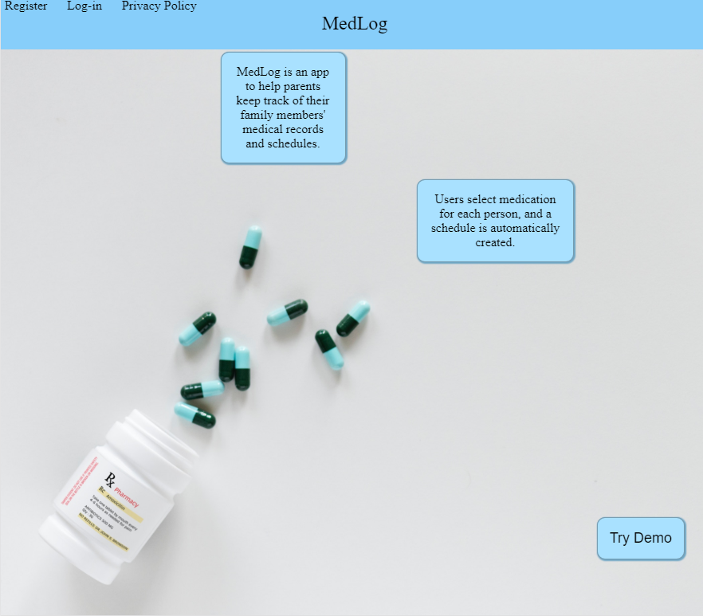
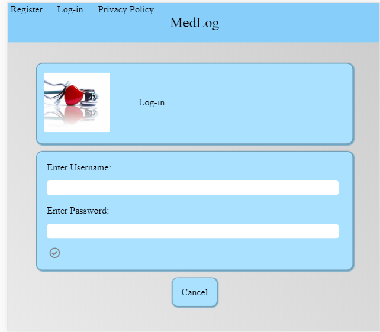
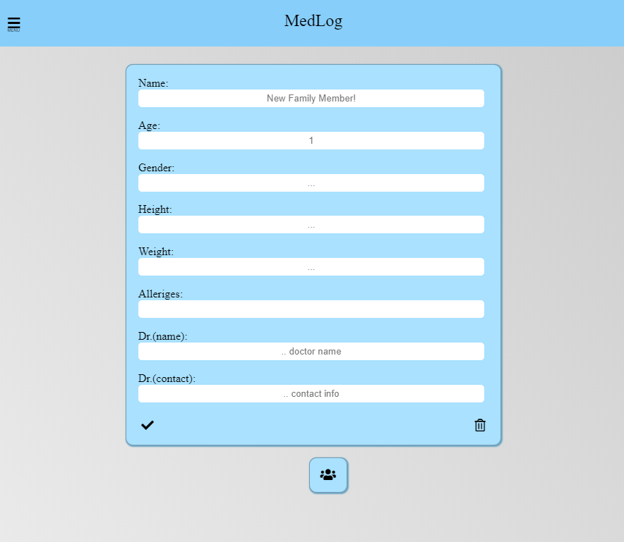
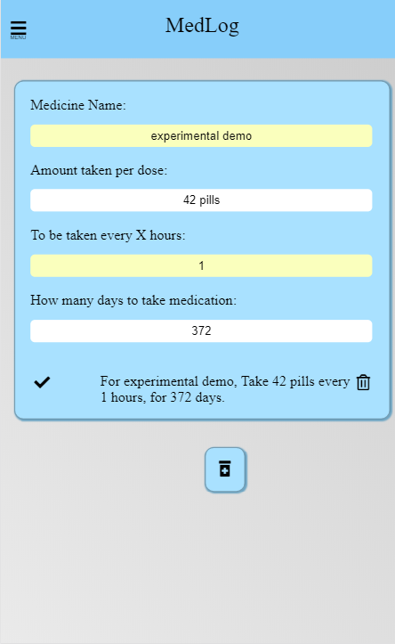
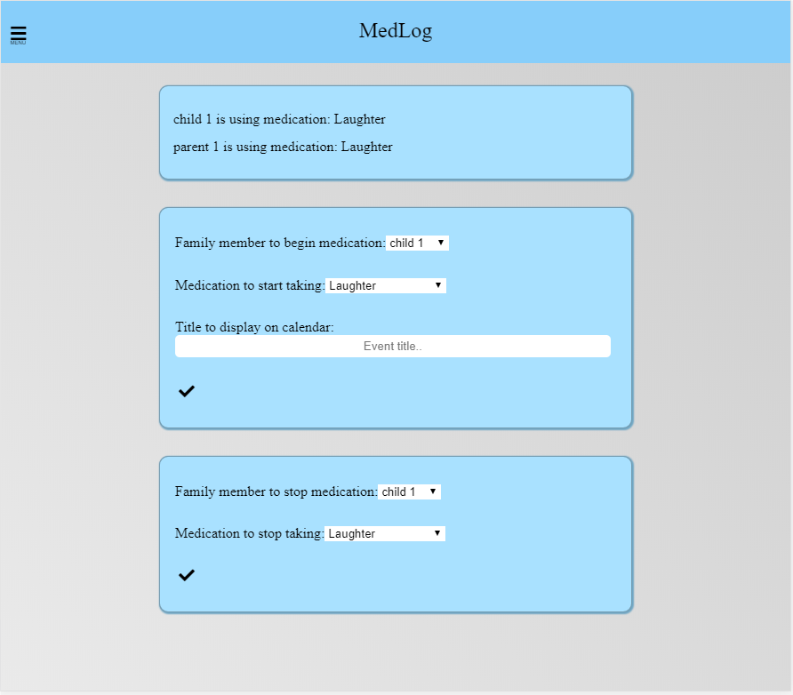
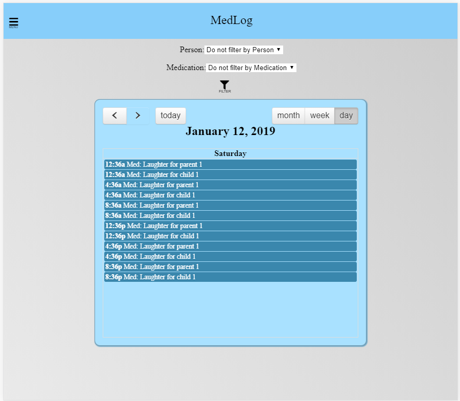
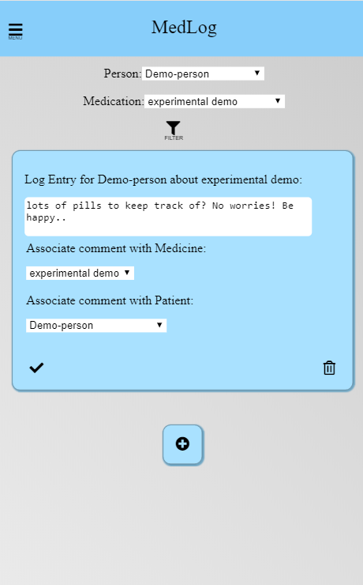
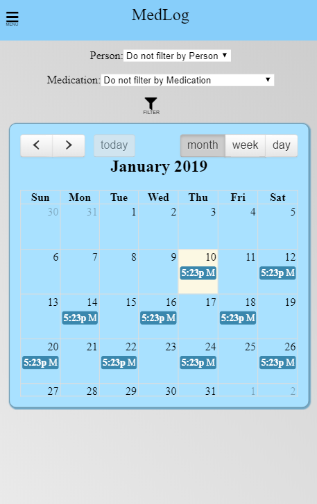
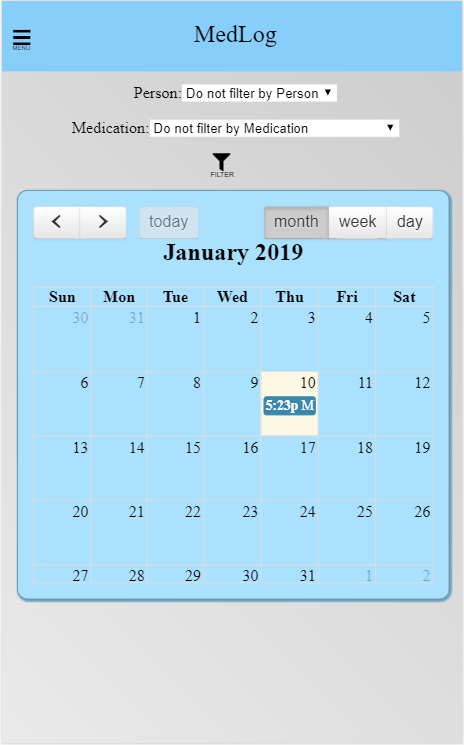
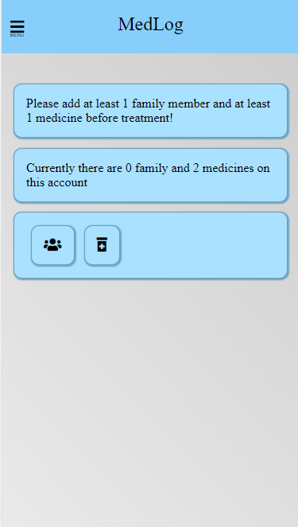

# Project Description:
    "MedLog is an app to help parents keep track of their family members' medical records and schedules.  A person can create a record containing information about which medication(s) and the times they need to be taken, for everyone in the family, including pets.  After filling out the details of each family member, which medicine they are on, a schedule can be viewed for the entire family, to see who needs to take what and when.  A calendar view can show everyone's appointments all together or filtered to just display a single person's schedule or log.  Entries can be added to a person's log when side effects, reactions, or symptoms appear, or if a scheduled appointment was missed."

## Project Links:
    Live deploy:
    https://james-medlog.herokuapp.com
    Github client:
    https://github.com/thinkful-ei26/james-Medlog-client
    Github server:
    https://github.com/thinkful-ei26/james-Medlog-server

## Tech Stack:
    React for the frontend
    Redux for state management
    Node for the backend
    Express backend framework
    MongoDB for the database
    JWTs for authentication
    Mocha and Chai for endpoint testing
    Enzyme for React component testing

## Screenshots:

Create, update and remove family members is easy:

Create, update, and remove medication, also easy:

Start, Stop, and view who is using which medicines:

Starting someone on medicine adds a calendar viewable by month, day or week:

Also record medical related events in a filterable log.

Changing the medicine times:

Automatically adjusts the schedule:

Stopping treatment clears the future scheduled events,
but keeps the history as a record:

Trying to start treatment or a journal comment without at least 1 person and 1 medication
displays buttons for the user to add people and medicine
and shows the number currently on the account:

This project was bootstrapped with [Create React App](https://github.com/facebook/create-react-app).

## Available Scripts

In the project directory, you can run:

### `npm start`

Runs the app in the development mode. 
Open [http://localhost:3000](http://localhost:3000) to view it in the browser.

The page will reload if you make edits. 
You will also see any lint errors in the console.

### `npm test`

Launches the test runner in the interactive watch mode. 
See the section about [running tests](https://facebook.github.io/create-react-app/docs/running-tests) for more information.

### `npm run build`

Builds the app for production to the `build` folder. 
It correctly bundles React in production mode and optimizes the build for the best performance.

The build is minified and the filenames include the hashes. 
Your app is ready to be deployed!

See the section about [deployment](https://facebook.github.io/create-react-app/docs/deployment) for more information.

### `npm run eject`

**Note: this is a one-way operation. Once you `eject`, you can’t go back!**

If you aren’t satisfied with the build tool and configuration choices, you can `eject` at any time. This command will remove the single build dependency from your project.

Instead, it will copy all the configuration files and the transitive dependencies (Webpack, Babel, ESLint, etc) right into your project so you have full control over them. All of the commands except `eject` will still work, but they will point to the copied scripts so you can tweak them. At this point you’re on your own.

You don’t have to ever use `eject`. The curated feature set is suitable for small and middle deployments, and you shouldn’t feel obligated to use this feature. However we understand that this tool wouldn’t be useful if you couldn’t customize it when you are ready for it.

## Learn More

You can learn more in the [Create React App documentation](https://facebook.github.io/create-react-app/docs/getting-started).

To learn React, check out the [React documentation](https://reactjs.org/).