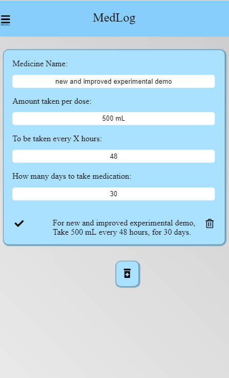

Project Description:
    "MedLog is an app to help parents keep track of their family members' medical records and schedules.  A person can create a record containing information about which medication(s) and the times they need to be taken, for everyone in the family, including pets.  After filling out the details of each family member, which medicine they are on, a schedule can be viewed for the entire family, to see who needs to take what and when.  A calendar view can show everyone's appointments all together or filtered to just display a single person's schedule or log.  Entries can be added to a person's log when side effects, reactions, or symptoms appear, or if a scheduled appointment was missed."

Project Links:
    Live deploy:
    https://james-medlog.herokuapp.com
    Github client:
    https://github.com/thinkful-ei26/james-Medlog-client
    Github server:
    https://github.com/thinkful-ei26/james-Medlog-server

Project Stack:
    React for the frontend
    Redux for state management
    Node for the backend
    Express backend framework
    MongoDB for the database
    JWTs for authentication
    Mocha and Chai for endpoint testing
    Enzyme for React component testing

Screenshots:

Create, update and remove family members is easy:

Create, update, and remove medication, also easy:

Start, Stop, and view who is using which medicines:

Starting someone on medicine adds a calendar viewable by month, day or week:

Also record medical related events in a filterable log.

Changing the medicine times:

Automatically adjusts the schedule:

Stopping treatment clears the future scheduled events,
but keeps the history as a record:
